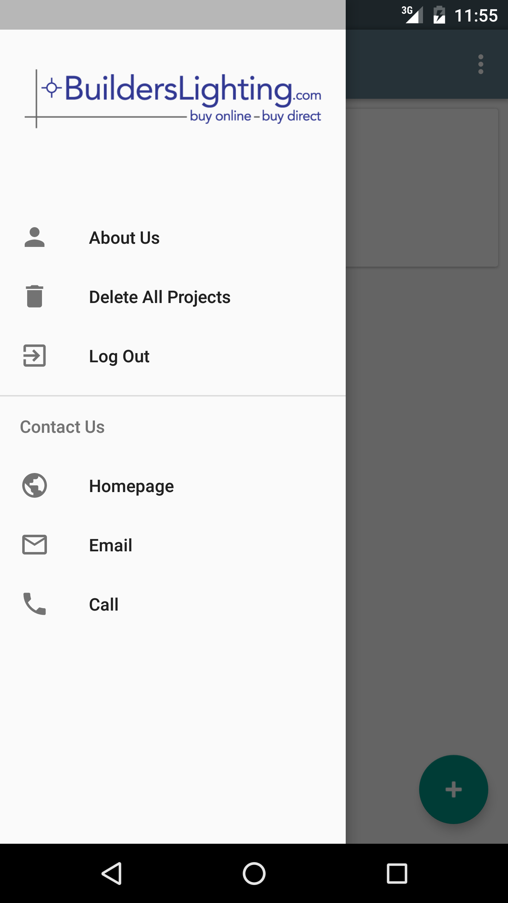
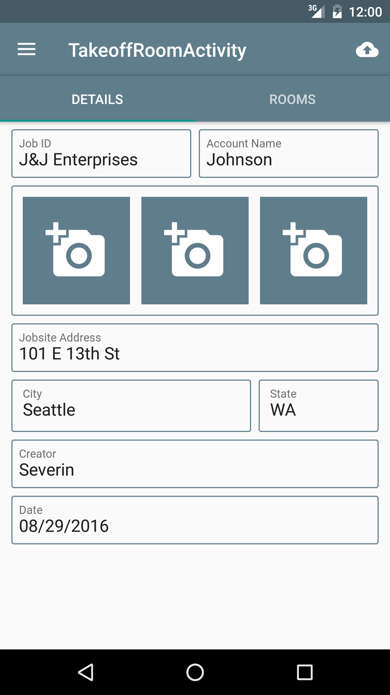

#Builders Lighting

##Contributors

[Matthew Duffin] (https://duffin22.github.io/) - Android Developer

[Severin Rudie] (https://www.linkedin.com/in/severin-rudie) - Android Developer

[Michael M Kang] (michaelmkang.com) - Android Developer

The app is aimed at simplifying the process of large-scale ordering for lighting contractors.  

The screenshots above show the four activities of the app. 
 - The first is a login activity which a user will see when the app is started. 
 - The second is a navigation drawer which a user has an access to through out the application.
 - Next is where user will see the list of rooms and lights for each rooms and the quantities.
 - In last activity, the user will be able to look at the project information and edit them.
 
###Project Requirements
#######
For this project, Our team was given an application currently used by Builders Lighting and it's users and asked to re-construct it to streamline the application and make it more user-friendly. The new application was to have all of the functions of the previous application while improving the usability. 

###Summary
#######
It was our first contract project with actual client. We were faced with many obstacles but we managed to produce a complete application which satisfied our first client within the time limit of a week. You will be able to download the application from Google Play Store in the future.  
